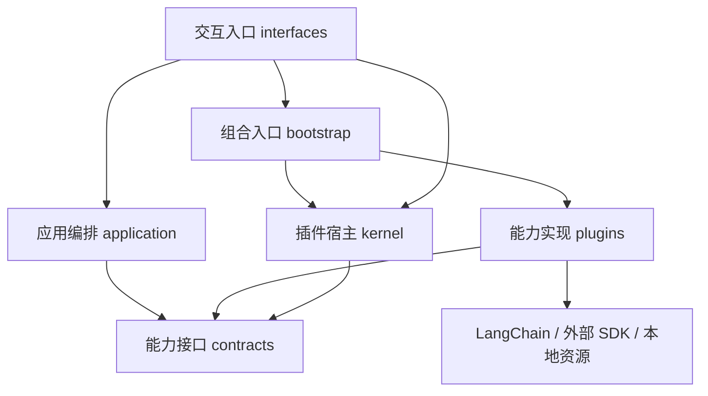

# 目标架构

状态：应用配置使用 YAML 显式装配。阶段 1 插件宿主已完成；阶段 2 已实现 Agent 运行接口、LangChain 运行时、模型、加法工具和内存 checkpoint，真实端点验收进行中。阶段 3 已提供只读文件能力与工具，本地验收通过；持久会话继续按后续阶段推进。

## 已确认原则

从第一版建立能力接口、插件宿主、具体能力实现和应用入口的边界。最小 Agent 闭环也遵守依赖方向，不先实现耦合原型再回补插件化。初期使用一个 Python 发行包，按模块隔离职责，只实现当前阶段真实消费的接口。

模型、工具、会话存储与 Agent 运行时通过接口替换。默认运行时内部使用 LangChain `create_agent`；BridgeAgent 管理装配、配置、依赖和资源生命周期，不维护第二套模型—工具循环。

首个入口为 CLI；首期插件是可信、同进程的 Python 代码，启动时显式装配。第三方包发现安排在阶段 6；完整 Cordis 风格插件机制，包括动态依赖、上下文作用域、事件与热重载，安排在阶段 7。不可信插件隔离另行评估。

首个真实任务为读取指定仓库、回答代码问题并给出文件位置。模型插件接入 OpenAI 或兼容服务，模型名称和服务地址可配置。文件修改与命令执行放在后续阶段，不混入只读验收。

阶段 3.5 通过 Skill 插件提供发现、按需加载 `SKILL.md` 与参考资料、上下文接入能力。Skill 是任务指导与资源，插件是承载该机制的程序实现；Agent 依指导调用已有工具。先支持只读流程，阶段 5 再扩展文件修改与脚本执行，不依赖阶段 7 的动态插件机制。

## 模块分层

下列目录已在阶段 1 建立；表内 Agent 相关职责是后续目标。当前实现范围见 [阶段 1](stages/01-plugin-host.md)。

| 层 / 模块 | 负责 | 依赖约束 |
| --- | --- | --- |
| 能力接口 `contracts/` | Agent 运行接口、模型/工具/会话等最小能力协议 | 不导入具体 provider、CLI 或组合配置 |
| 插件宿主 `kernel/` | 依赖验证、服务注册、激活关闭、资源归属 | 只认识插件协议，不实现模型—工具循环 |
| 应用编排 `application/` | 创建运行、提交任务、取消、返回结果等用例 | 使用能力接口，不直接构造 LangChain Agent 或具体后端 |
| 能力实现 `plugins/` | 默认运行时、模型适配、工具、策略和会话后端 | 实现能力接口，按声明使用其他能力 |
| 交互入口 `interfaces/` | CLI 输入输出，以及将来的其他入口 | 调用应用用例，不决定插件内部行为 |
| 组合入口 `bootstrap/` | 读取配置、选择插件实现、调用宿主装配、启动入口 | 可以了解具体实现；其他业务模块不反向依赖它 |



箭头表示源码依赖方向，不表示运行时顺序。宿主按协议接收插件，不直接导入内置实现。接口按能力组织，避免集中成一个大类型文件；Service Definition / Provider / Consumer 是职责划分，当前不要求拆成三个发行包。

阶段 1 的模块命令是进程入口：调用 bootstrap 获取显式配置，并管理宿主的启动与关闭；application 只收到能力对象。组合与进程入口可以了解宿主，应用用例和具体插件不反向依赖组合入口。

## 默认执行链

```text
CLI → 应用用例 → AgentRuntime 接口
                    ↓ 默认实现
             LangChain 运行时插件
                    ↓ 装配
          create_agent(model, tools, middleware)
                    ↓
             模型请求 ⇄ 工具执行
                    ↓
                结果返回 CLI
```

运行时插件将选中的模型、工具和执行扩展适配到 LangChain。应用层不依赖 LangGraph 图对象。边界只包装实际需要稳定的输入输出，不重复定义全部 LangChain 消息和工具类型。

middleware 是插件提供的一种执行扩展，不等于插件本身。LangChain 的 before、after 和 wrap 有特定执行顺序，适配层必须保留其语义，不能全部映射为同序广播。参考：[middleware 执行规则](https://docs.langchain.com/oss/python/langchain/middleware/custom)。

## 配置与装配

首期通过 YAML 配置选择显式插件清单中的名称，并给出插件参数。组合入口负责名称到实现的映射；插件声明依赖并验证各自配置，宿主按依赖顺序激活。YAML 仅承载数据：使用安全解析方式，不接受可执行标签或任意对象构造，不执行 Python 表达式，也不直接加载任意模块路径。

模型名称、服务地址与密钥通过配置引用环境变量名称；阶段 2 已接入，并支持显式读取 `.env`。阶段 1 的 `version` / `plugins` 格式继续使用 PyYAML 与 Pydantic，不提供通用环境插值。Python 包元数据与开发工具配置仍使用标准的 `pyproject.toml`，与应用装配配置分开。

## 生命周期

启动：读取配置 → 验证依赖和冲突 → 按依赖激活 → 组装 Agent → 接受任务。

关闭：停止接受新任务 → 处理运行中任务的停止 → 逆序释放插件贡献与资源。

阶段 1 就定义并验证缺失依赖、循环依赖、重复注册、激活失败回滚与退出清理。运行中动态改变插件不在首期承诺内。

阶段 7 扩展为完整动态生命周期，按参考基线建立逐项行为对齐与测试矩阵。阶段 1 的静态依赖验证、阶段 7 的运行中依赖变化分别定义，不能用首期遇到缺失依赖就失败的规则代替动态停用与重激活。前期保留资源归属和接口分层，具体动态状态机到阶段 7 细化。

## 首期运行与工作区范围

一次 CLI 进程只管理一个工作区和一个 Agent，同一会话串行接收多轮输入。首期不做后台并发任务和多 Agent。串行任务范围不等同于承诺运行时内部完全没有异步操作；工具执行并发如要启用，应在能力实现中明确验证。

只读工具处理指定工作区内的文本文件，默认遵守 `.gitignore`，并排除 `.git`、`.env` 和常见私钥文件。列举、检索和读取共享访问策略；符号链接解析后的目标仍须位于工作区内，读取有大小限制，具体阈值和完整排除清单在阶段 3 定义。

上述规则限制提供给 Agent 的文件能力。可信同进程 Python 插件本身仍能使用进程权限，不将这些规则描述为隔离恶意插件的操作系统沙箱。

## 状态与事件

已确认：默认运行时使用 LangGraph checkpoint 管理会话执行状态与恢复，执行日志用于观察和排障。应用层通过运行时接口提交输入、查询状态或续接；日志不反向驱动恢复，也不承诺完整重建所有模型输入。决策见 [ADR-0003](adr/0003-checkpoints-own-recovery-state.md)。

阶段 2 先接入内存 checkpoint，阶段 4 再引入持久化实现。运行时插件负责框架状态适配，会话存储实现负责对应状态的保存与读取；不要求任意运行时的内部状态格式相互兼容，也不在应用层另存一份权威消息历史。

具体持久化后端、恢复点范围和工具副作用处理仍需在实施前定义。文件修改与命令执行引入时，要明确中断后的结果确认和重试规则。

观察通知、执行拦截和持久事实具有不同语义，不用一个通用事件总线代替所有机制。

## 替换性验收

同一个应用用例可切换模型实现、添加工具，无需修改应用层和默认循环。另一个最小运行时实现应能通过同一应用接口执行，以验证应用层未依赖 LangChain 的具体类型。替换会话存储时，验证其能力与所选运行时的要求匹配，而不是假定任意存储都能承载任意运行时状态。
